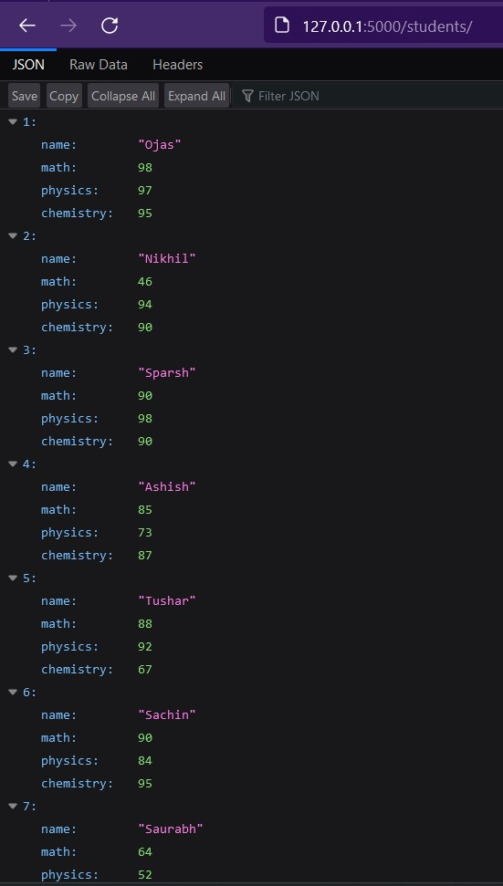
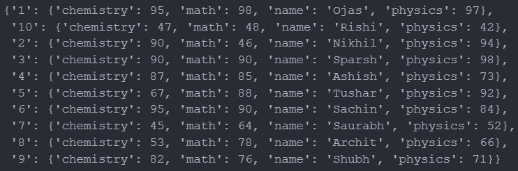
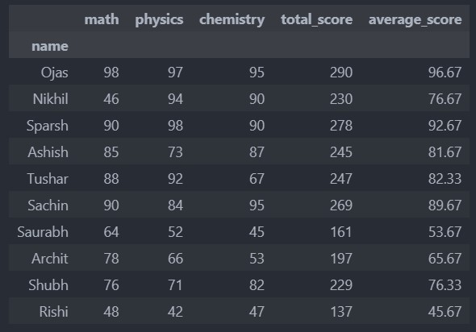
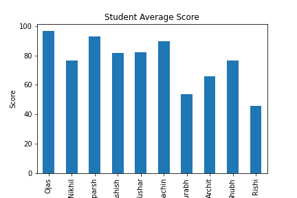
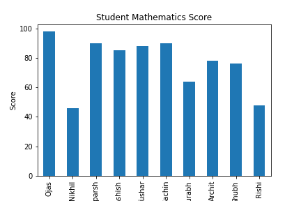
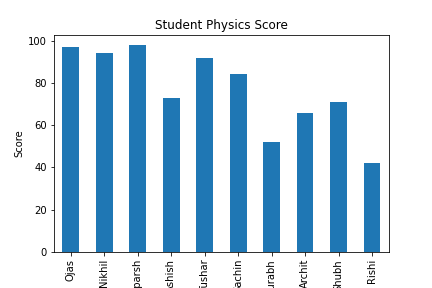
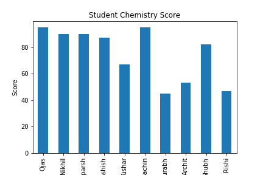

# Task 2: Data Processing and Visualization

For this task, I tried to find an API that could be used to fetch student scores but I couldn't find the right fit, so I made a simple REST API using Flask and put 10 students mock data into it.

### Here's a the REST API running locally on my PC:

After that I used requests library to fetch the data from the API and parsed it into proper JSON format.

### Here's the response from the API:

After retrieving the data, I converted it into a Pandas DataFrame, calculated and added total_score, average_score columns to the DataFrame.

### Here's the final processed DataFrame:

Finally using the matplotlib library, I visualized the data using bar charts for average scores and all three subjects.

### Bar Charts

