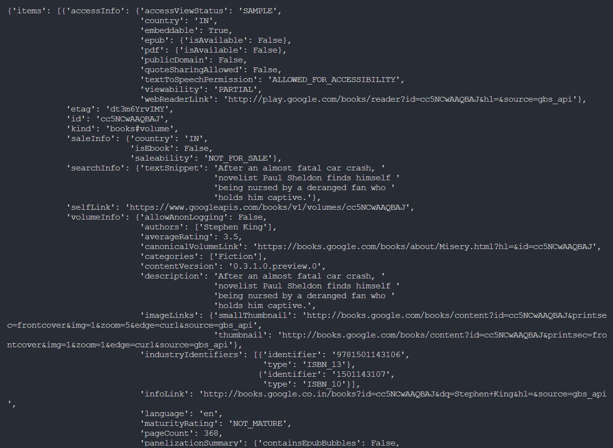
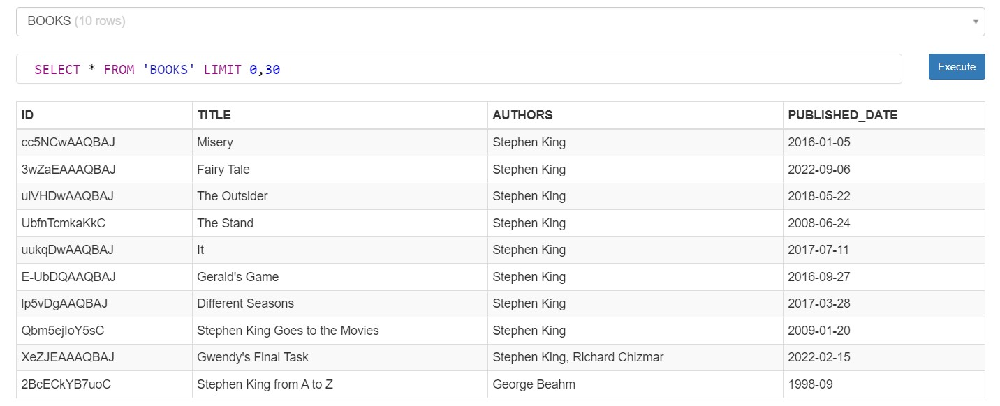

# Task 1: API Data Retrievel and Storage

For this task, I decided to use Google Books API and retrieve data from it using the search query and store it into a local sqlite database. First, an API Key was generated for using Google Books API and then the data was retrieved using GET requests using the requests library in Python. The retrieved data was parsed into proper json format using json libary.

### Here's a snapshot of the data retrieved from the API:

After parsing the data, only the required information (Book ID, Book Title, Authors and Date of Publishing) was selected and stored into a local sqlite database using sqlite3 library.

### Here's a snapshot of the BOOKS table from the local database:

