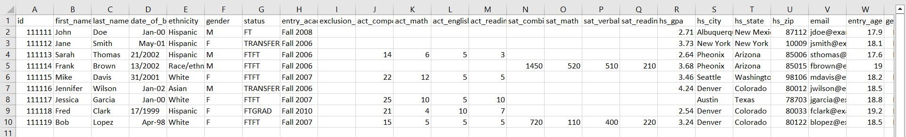
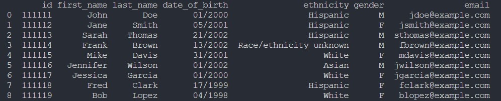
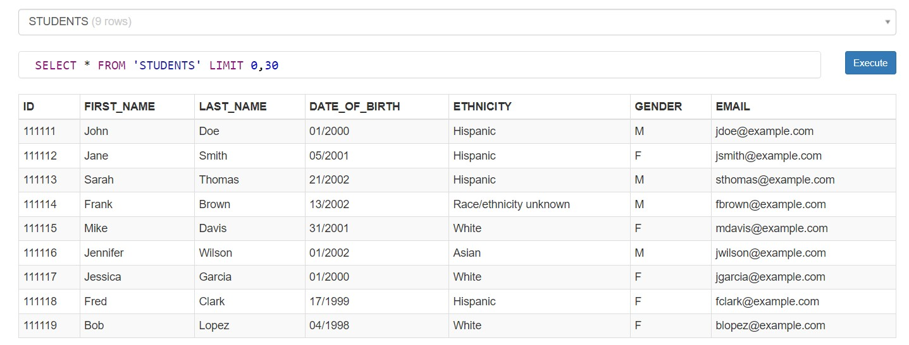

# Task 3: CSV Data Import to a Database

For this task, a CSV file containing students' information was used which was obtained from http://ecmc-z41d.damoursystems.com/data_sets/students.html

### Here's the original CSV File:

After importing the CSV file using Pandas library, all the null values were dropped and only 7 columns containing important information was kept to be stored into sqlite database.

### Here's the final DataFrame:

Finally, a table was created using sqlite3 library and the values of the dataframe were inserted into the table.

### Here's the STUDENTS table from the database:
